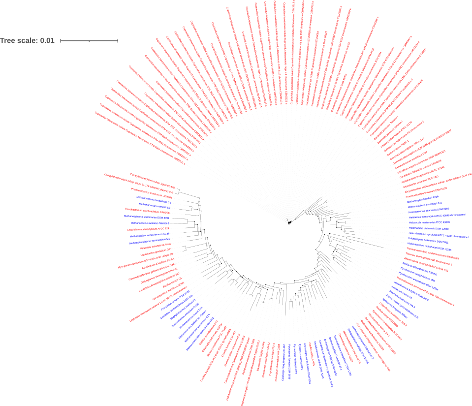

# K-Mer

## University Homework: Statistics on decomposed Genomes 

&nbsp;

In this project we review the potential of Kmer analysis for phylogeny inference as well as detection of horizontal transfers. 

We mainly use [kython](https://www.github.com/LeroyAdrien/Kython) to make our computations, a python package we devised for the occatsion (Documentation is avalailable on the link)

Everything is described in the Notebook folder 
